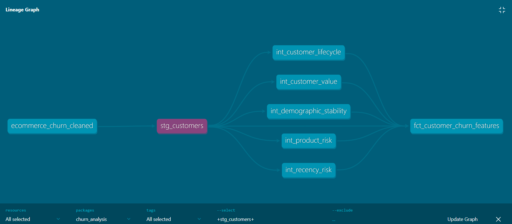

# 🛒 E-Commerce Customer Churn Prediction

A comprehensive machine learning project predicting customer churn using advanced feature engineering, dbt pipelines, and XGBoost modeling, achieving **96.2% ROC-AUC**.

[](https://www.python.org/)
[](https://www.getdbt.com/)
[](https://xgboost.readthedocs.io/)
[](LICENSE)

---

## 📊 **Project Overview**

This project analyzes 3,270 e-commerce customers to predict churn and identify key retention drivers. Using rigorous statistical analysis, professional data engineering with dbt, and advanced machine learning, the model achieves **0.962 ROC-AUC** and catches **69% of churners** (vs 46% baseline).

### **Key Achievements**

- 🎯 **0.962 ROC-AUC** with XGBoost (4.6% improvement over Random Forest)
- 📊 **49 automated data quality tests** ensuring pipeline reliability
- 🔧 **22 engineered features** from 12 raw features using dbt
- 📈 **73.7% churn prediction** for highest-risk customers (validated)
- 🏆 **Top predictor**: `cashback_per_month` (engineered feature, 24% importance)

---

## 🎯 **Business Impact**

### **Top 5 Churn Drivers Discovered**

| Driver | Impact | Actionable Insight |
|--------|--------|-------------------|
| **Tenure** | 7x difference | New customers (0-3mo) churn at 35% vs 5% for established |
| **Product Category** | 6.5x difference | Mobile buyers churn 6.5x more than grocery buyers |
| **Complaints** | 3x difference | Customers who complained have 31.8% churn vs 10.3% |
| **Marital Status** | 2.4x difference | Singles churn 2.4x more than married customers |
| **Recency** | U-shaped pattern | Both very recent (16.8%) and dormant (31.6%) customers at risk |

### **Business Recommendations**

1. **90-Day Onboarding Program** → Reduce new customer churn from 35% to target 15%
2. **24-Hour Complaint Resolution SLA** → Save 155 customers annually ($77,500 value)
3. **Win-Back Campaign for Dormant Customers** → Target 30+ days inactive
4. **Product-Specific Retention** → Different strategies for tech vs grocery buyers
5. **Demographic Targeting** → Tailored messaging for singles vs married customers

**Estimated Annual Value:** $230,000+ in retained revenue

---

## 🏗️ **Project Architecture**

### **Data Pipeline**
```
Raw Data (CSV)
      ↓
  📊 EDA & Cleaning (pandas, scipy)
      ↓
  🔧 dbt Feature Engineering Pipeline
      ├── Staging Layer (stg_customers)
      ├── Intermediate Layer (5 models)
      │   ├── Lifecycle Segmentation
      │   ├── Recency Risk
      │   ├── Product Risk
      │   ├── Demographic Stability
      │   └── Customer Value
      └── Features Layer (fct_customer_churn_features)
      ↓
  🤖 ML Models (XGBoost + Random Forest)
      ↓
  📈 Predictions & Insights
```


*dbt pipeline showing data flow from seed through transformations to final features*

---

## 📈 **Model Performance**

### **XGBoost (Final Model)**

| Metric | Score | Interpretation |
|--------|-------|----------------|
| **ROC-AUC** | 0.962 | Excellent discrimination |
| **Accuracy** | 92% | Overall prediction accuracy |
| **Precision (Churn)** | 81% | 81% of predicted churners are correct |
| **Recall (Churn)** | 69% | Catches 69% of actual churners |
| **F1-Score (Churn)** | 0.75 | Strong balanced performance |

### **Comparison: XGBoost vs Random Forest**
```
                  Random Forest    XGBoost    Improvement
ROC-AUC              0.920          0.962        +4.6%
Recall (Churn)        46%            69%         +50%
Churners Caught      49/107         74/107      +25 customers
```

**Why XGBoost Won:**
- Better handling of class imbalance (16.8% churn rate)
- Sequential learning from previous trees' mistakes
- Built-in regularization prevents overfitting
- Better captures feature interactions (e.g., new customer + tech buyer = very high risk)

### **Feature Importance (Top 10)**

| Rank | Feature | Importance | Type |
|------|---------|-----------|------|
| 1 | `cashback_per_month` | 24.1% | 🔧 Engineered |
| 2 | `composite_risk_score` | 15.3% | 🔧 Engineered |
| 3 | `tenure` | 12.6% | Raw |
| 4 | `is_new_customer` | 7.9% | 🔧 Engineered |
| 5 | `has_complained` | 7.0% | Raw |
| 6 | `lifecycle_stage_new_high_risk` | 4.6% | 🔧 Engineered |
| 7 | `num_addresses` | 3.8% | Raw |
| 8 | `cashback_amount` | 3.2% | Raw |
| 9 | `days_since_last_order` | 2.5% | Raw |
| 10 | `satisfaction_score` | 1.7% | Raw |

**5 out of top 10 features are engineered!** 🎯

---

## 🔬 **Key Statistical Findings**

### **1. U-Shaped Recency Pattern**

Linear correlation suggested weak relationship (r = -0.048), but binned analysis revealed strong U-shaped pattern:
```
Days Since Last Order    Churn Rate    Pattern
0-7 days                   16.8%       High (new customers testing)
8-14 days                   9.3%       Moderate
15-30 days                  2.6%       ★ SWEET SPOT (lowest risk!)
31-47 days                 16.9%       High (going dormant)
47+ days                   31.6%       Very high (dormant)
```

**Lesson:** Always visualize relationships - linear metrics can miss non-linear patterns!

### **2. Satisfaction Score Paradox**

Higher satisfaction scores paradoxically correlated with higher churn (r = +0.098):

- Score 1: 11.2% churn (lowest!)
- Score 5: 22.8% churn (highest!)

**Hypothesis:** Survivorship bias - dissatisfied customers churn *before* rating, only stable complainers remain to give low scores.

### **3. Composite Risk Score Validation**

Created risk score (0-4) combining 5 factors: new customer + tech buyer + complained + single + dormant
```
Risk Score    Customers    Actual Churn Rate    Prediction Validated
    0            837            1.2%                   ✓
    1          1,100            5.6%                   ✓
    2            851           27.9%                   ✓
    3            372           46.7%                   ✓
    4            110           73.7%                   ✓ (predicted ~80%)
```

**The composite risk score works exactly as designed!**

---

## 🛠️ **Technical Stack**

### **Data Analysis & ML**
- **Python 3.11** - Core programming language
- **pandas** - Data manipulation and analysis
- **NumPy** - Numerical computing
- **scikit-learn** - Machine learning (Random Forest, preprocessing)
- **XGBoost** - Gradient boosting (final model)
- **scipy** - Statistical testing (Pearson, Spearman, Chi-square, Bonferroni)

### **Data Engineering**
- **dbt (Data Build Tool)** - SQL-based transformation pipeline
- **DuckDB** - Embedded analytical database
- **dbt_utils** - Additional testing and macros

### **Visualization**
- **matplotlib** - Statistical plots
- **seaborn** - Advanced visualizations

### **Development**
- **Jupyter** - Interactive analysis notebooks
- **VS Code** - Primary IDE
- **Git** - Version control

---

## 📂 **Project Structure**
```
ecommerce-churn-prediction/
│
├── README.md                           ← You are here
├── requirements.txt                    ← Python dependencies
├── .gitignore                          ← Git exclusions
│
├── data/                               ← Data & models
│   ├── ecommerce_churn_cleaned.csv    (3,270 customers)
│   ├── ml_features.csv                 (ML-ready features)
│   ├── best_model.pkl                  (XGBoost model)
│   ├── eda_summary.md                  (EDA findings)
│   └── model_comparison_results.json   (RF vs XGB metrics)
│
├── notebooks/                          ← Analysis notebooks
│   └── 01_eda.ipynb                    (Exploratory Data Analysis)
│
├── churn_analysis/                     ← dbt project
│   ├── models/
│   │   ├── staging/
│   │   │   └── stg_customers.sql       (Clean raw data)
│   │   ├── intermediate/
│   │   │   ├── int_customer_lifecycle.sql
│   │   │   ├── int_recency_risk.sql
│   │   │   ├── int_product_risk.sql
│   │   │   ├── int_demographic_stability.sql
│   │   │   └── int_customer_value.sql
│   │   ├── features/
│   │   │   └── fct_customer_churn_features.sql
│   │   └── schema.yml                  (Tests & documentation)
│   ├── seeds/
│   │   └── ecommerce_churn_cleaned.csv
│   ├── dbt_project.yml                 (dbt configuration)
│   └── packages.yml                    (dbt_utils package)
│
├── compare_models.py                   ← Model training & comparison
├── data_prep.py                        ← Reusable data preparation
│
└── docs/                               ← Documentation & screenshots
    └── screenshots/
        ├── lineage_graph.png
        ├── feature_table.png
        └── composite_risk_score.png
```

---

## 🚀 **Getting Started**

### **Prerequisites**

- Python 3.11+
- conda or venv for environment management

### **Installation**
```bash
# Clone the repository
git clone https://github.com/YOUR_USERNAME/ecommerce-churn-prediction.git
cd ecommerce-churn-prediction

# Create virtual environment
conda create -n churn-project python=3.11
conda activate churn-project

# Install dependencies
pip install -r requirements.txt
```

### **Quick Start**

#### **1. Run EDA (Optional - results already in data/)**
```bash
jupyter notebook notebooks/01_eda.ipynb
```

#### **2. Build dbt Pipeline**
```bash
cd churn_analysis

# Load seed data
dbt seed

# Run transformations
dbt run

# Run tests (49 tests)
dbt test

# Generate & view documentation
dbt docs generate
dbt docs serve
```

#### **3. Train Models**
```bash
cd ..
python compare_models.py
```

**Output:**
- `data/best_model.pkl` - XGBoost model (0.962 ROC-AUC)
- `data/model_comparison_results.json` - Performance metrics
- `data/model_comparison.png` - Visual comparison

---

## 📊 **Key Results**

### **Dataset Summary**
- **Total Customers:** 3,270 (after deduplication from 3,941)
- **Churn Rate:** 16.8%
- **Features:** 12 raw → 35 engineered (38 total with metadata)
- **Time Period:** 2023-2024

### **Statistical Rigor**
- ✅ Bonferroni correction for multiple testing
- ✅ Proper tests for data types (Chi-square for categorical, Pearson for continuous)
- ✅ Phi coefficient for binary associations
- ✅ Non-linear pattern detection (U-shaped recency)
- ✅ Outlier impact assessment

### **Model Results**
- ✅ XGBoost: 0.962 ROC-AUC
- ✅ Random Forest: 0.920 ROC-AUC
- ✅ Catches 74/107 churners (69% recall)
- ✅ 81% precision on churn predictions

### **Pipeline Quality**
- ✅ 49 automated tests (all passing)
- ✅ Full dbt documentation with lineage
- ✅ Modular, reusable code structure
- ✅ Version controlled with Git

---

## 🎓 **Key Learnings**

### **Statistical Insights**
1. **Linear correlation can miss important patterns** - U-shaped recency had r=-0.048 but strong predictive power
2. **Always investigate missing values before imputing** - Our filled values (dormant customers) were meaningful, not random
3. **Multiple testing requires correction** - Bonferroni correction ensures statistical rigor
4. **Outliers can significantly impact metrics** - 184 filled values (5.6%) changed correlation by 0.112

### **Feature Engineering**
1. **Engineered features often outperform raw features** - `cashback_per_month` (engineered) became #1 predictor
2. **Domain knowledge beats algorithms** - Lifecycle stages based on business understanding performed excellently
3. **Composite scores are powerful** - Combining 5 risk factors into one score provided clear risk tiers

### **Modeling**
1. **XGBoost excels with imbalanced data** - 16.8% churn rate handled better than Random Forest
2. **Sequential learning matters** - XGBoost's boosting caught 51% more churners than RF's bagging
3. **Model comparison is essential** - 4.6% ROC-AUC improvement = 25 more customers caught

### **Data Engineering**
1. **dbt provides production-quality pipelines** - Modular, tested, documented transformations
2. **Tests prevent data quality issues** - 49 automated tests catch problems early
3. **Documentation is as important as code** - Lineage graphs communicate architecture clearly

---

## 📚 **Documentation**

- **[EDA Summary](data/eda_summary.md)** - Complete exploratory analysis findings
- **[dbt Docs](http://localhost:8080)** - Interactive pipeline documentation (run `dbt docs serve`)
- **[Model Comparison](data/model_comparison_results.json)** - Detailed performance metrics

---

## 🤝 **Contributing**

This is a portfolio project, but suggestions and feedback are welcome!

1. Fork the repository
2. Create your feature branch (`git checkout -b feature/AmazingFeature`)
3. Commit your changes (`git commit -m 'Add some AmazingFeature'`)
4. Push to the branch (`git push origin feature/AmazingFeature`)
5. Open a Pull Request

---

## 📧 **Contact**

**Małgorzata Kot** - [malgorzatakot92@gmail.com](mailto:malgorzatakot92@gmail.com)

**LinkedIn:** [www.linkedin.com/in/małgorzata-kot-18659216b](www.linkedin.com/in/małgorzata-kot-18659216b)

**Project Link:** [github.com/yourusername/ecommerce-churn-prediction](https://github.com/yourusername/ecommerce-churn-prediction)

---

## 🙏 **Acknowledgments**

- **Dataset:** [Kaggle - E-Commerce Customer Churn](https://www.kaggle.com/datasets/samuelsemaya/e-commerce-customer-churn) by Samuel Semaya
- **Tools:** dbt, XGBoost, scikit-learn, pandas community
- **Inspiration:** Real-world e-commerce retention challenges

---

## 📄 **License**

This project is licensed under the MIT License - see the [LICENSE](LICENSE) file for details.

---

**⭐ If you found this project helpful, please consider giving it a star!**

---

*Built with ❤️ for data science and business impact*
